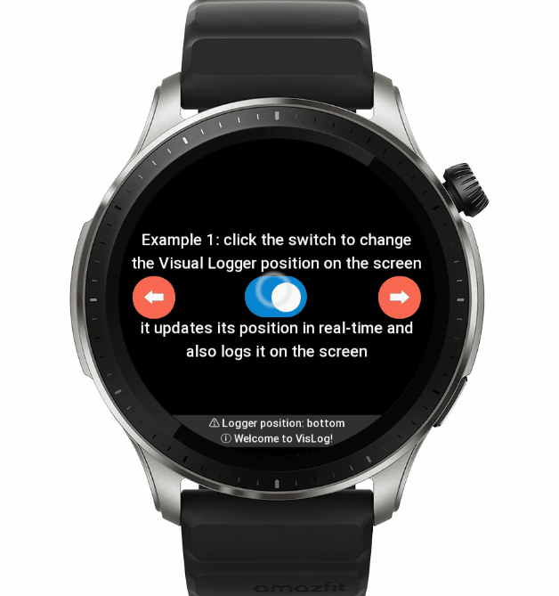

# ZeppOS Visual Logger: On-Screen Logs on Your Device


## Examples

### ⓘ Example 1: Switch logger's position in real-time with a single click.



With **Visual Logger**, you get exactly what you expect – all the logs you asked for, displayed directly on your emulator or physical device. Plus, with a built-in filter for repeated messages, **Visual Logger** shines in its ability to deliver the insights you need, exactly where you need them. Here are some key features that make **Visual Logger** stand out:

- It allows you to display log messages on the screen of your device, making it easy to see what’s happening in your code in real-time.
- It supports different log levels, such as “**LOG**”, “**INFO**”, “**WARN**”, “**ERROR**” and “**DEBUG**“, allowing you to categorize your log messages and easily identify issues.
- It provides a variety of customization options, such as changing the text size, text color, background color, and line count, allowing you to tailor the appearance of the visual log to your needs.
- It supports both console logging and visual logging, giving you the flexibility to choose how you want to view your log messages.
- It includes features such as the automatic removal of old messages after a timeout and the ability to include a prefix in log messages, making it easier to manage and organize your log output.

## ⚡️ Quickstart
### Visual Logger for ZeppOS 2.0+ [link](https://github.com/silver-zepp/zeppos-visual-logger/blob/master/2.0/dist/vis-log.js)
`npm i @silver-zepp/vis-log`
### Visual Logger for ZeppOS 1.0 [link](https://github.com/silver-zepp/zeppos-visual-logger/blob/master/1.0/vis-log.js)

You start by simply including it in your project:

```javascript
// install -> npm i @silver-zepp/vis-log
import VisLog from "@silver-zepp/vis-log";
const vis = new VisLog("index.js");
```

And then using it the usual **console.log(...)** or **logger.log(...)** style:

```javascript
vis.log("Hello World!");
vis.warn("Warning Here");
vis.info("This is your info");
vis.error("Here's an error");
```

Here's the result: You get clean logs on your device, and also they are mirrored with a help of a built-in **log** instance, which gives us colorful console logs with filtered levels.


#### ⓘ Important: If you don't see the logger try refreshing it. It might be buried behind other widgets! Try always keeping it drawn the last.
```javascript
vis.refresh();
```

## Visual Logger more examples

You’ve seen the first example in the **gif** above, so let’s quickly walk through the rest of them and then dive deeper into their implementation.

### ⓘ Example 2: The repeated messages do not clog the screen.


### ⓘ Example 3: Show it only when you need it, hide all the other times.


### ⓘ Example 4: Change its looks, to better cater to your app's theme.


## Ready to give it a try?

We have prepared a sample project for you to play with, which you can [**download Example**](https://github.com/silver-zepp/zeppos-visual-logger/tree/master/example-app/2.0) or clone the repository.

## Customizing your logger

Let’s have a closer look at some of the most important settings

```javascript
vis.updateSettings({ line_count: 5 })
```


[line_count] : specifies the number of messages (lines) before recycling them. If you’re planning to use a larger font size you might consider lowering the amount of lines visible. Or in case you want to have a logger that barely takes any screen space, you can just put it to **1**.

```javascript
vis.updateSettings({ timeout_enabled: true })
```

[timeout_enabled] : will make messages disappear after a timeout. Disable it when you don’t want to miss a message by going AFK for a minute. 

```javascript
vis.updateSettings({ log_from_top: false })
```

[log_from_top] : by default the logger stays on top of the screen and logs messages towards the bottom. Disable this if you want your messages to come from bottom to top.

```javascript
vis.updateSettings({ prefix_enabled: false })
```

[prefix_enabled] : this is mostly self-explanatory but you can disable it if you, for example, want to integrate **the chat app** inside your actual mini-app. This can be easily achieved with **Visual Logger**.

```javascript
vis.updateSettings({ padding_multiplier: 1.5 })
vis.updateSettings({ margin: text_size })
```

[padding_multiplier] & [margin] : you want to play with these values (mostly increase) in case your app is designed for a “**designWidth**” that is not equal to **480**. By default, the margin is enabled only when **Visual Logger** is run on a **round-shaped** screen, and its value is equal to the text size.

The rest of the settings are not that important but you can read more about what they do just by looking at hints provided by your **IntelliSense**, they all are explained with **JSDoc**.

Here are all the default settings of your logger, they are already applied so you don’t have to specify any of these for the logger to work out of the box.

```javascript
vis.updateSettings({
  line_count: 5,
  log_from_top: true,
  timeout_enabled: true,
  visual_log_enabled: true,
  background_color: 0x333333,
  text_color: 0x000000,
  text_size: 16,
  console_log_enabled: true,
  prefix_enabled: true,
  text_style: hmUI.text_style.ELLIPSIS,
  padding_multiplier: 1.5,
  margin: 16,
  filename: "",
});
```

**Note**: To change the **text_style**, make sure to import the **hmUI** namespace or assign the enum values manually. Here are their numerical values for reference:

```javascript
hmUI.text_style.CHAR_WRAP   = 0
hmUI.text_style.WRAP        = 1
hmUI.text_style.ELLIPSIS    = 2
hmUI.text_style.NONE        = 3
```

So if you want to change the text style you can go with one of these approaches

```javascript
import * as hmUI from "@zos/ui";
vis.updateSettings({
    text_style: hmUI.text_style.WRAP
})
```

```javascript
import VisLog, { hmUI } from "./path-to-vis/vis-log";
vis.updateSettings({
    text_style: hmUI.text_style.WRAP
})
```

```javascript
vis.updateSettings({ text_style: 1 })
```

## Real-World use case scenario

Here’s an example case where **Visual Logger** already played a **key role**, helping with the development of the **Mini Chess** game. We can observe how the **AI** thinks right on the screen of the physical device!


*_current example shows its work on the **Bip 5 Emulator.** And is running a **debug** version of the game that looks different than the end product._
